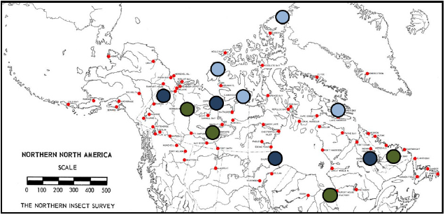

# Spatial Diversity of Acalyptrate Flies in the Northern Nearctic

## About
This dataset, from my Honours project, results from the 2010-2011 [Northern Biodiversity Program](http://insectecology.mcgill.ca/NBP/index.html), which aimed at documenting diversity patterns of Arctic arthropods. Specimens were collected in twelve locations across Northern Canada, from the Subarctic to the High Arctic zone, as shown in the following map.  Northern Boreal sites are in green, Subarctic sites in deep blue, and High Arctic sites in light blue. Small red dots represent the sites sampled during the 1947-1962 Northern Insect Survey, a precursor to the NBP (Blair et al., 2012).

## Hypotheses

## Statistical Analyses

##Literature Cited
Blair, M. S., Rochefort, S., Solecki, A. M., Vajda, E., & Wheeler, T. A. (2012). Two wings over the tundra: Higher Diptera research in the Northern Biodiversity Program. *Newsletter of the Biological Survey of Canada*, 31(1), 16-22.

